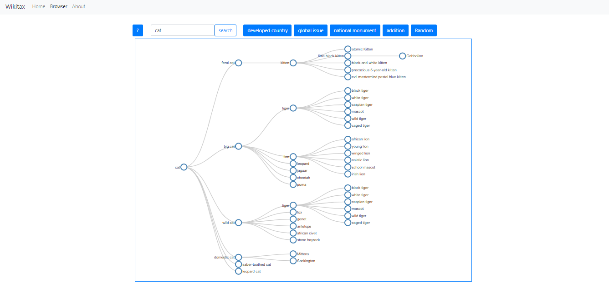

# Base.Camp21_WikipediaTaxonomien

Dieses Projekt erstellt eine Web-Applikation zur Suche und Darstellung der Taxonomien innerhalb von Wikipedia mittels der BigData Methoden Hadoop und MapReduce. 

Die Applikation visualisiert debei die gefundenen Taxonomien in Form eines interaktiven Suchbaumes. 

Die Demo der Applikation ist zu finden unter: 

http://basecamp-demos.informatik.uni-hamburg.de:8080/wikitax/

## Daten aus Wikipedia

Der Dump von Wikipedia kann im .xml Format heruntergeladen und entpackt werden werden. Der entsprechende Konsolenbefehl lautet:

`bunzip2 DUMP.xml.bz2`

Anschließend muss der Dump mittels des *Wikiextractors* konvertiert werden. Dabei ist es möglich den Dump in mehrere Textdateien aufzuteilen. Die entsprechende Konsolenbefehle lauteten:

`pip install wikiextractor`

`python -m wikiextractor.WikiExtractor -o OUTPUT_FOLDER -b 200M INPUT.xml`

Die Dumps sind zu finden unter: 
https://dumps.wikimedia.org/enwiki/

Der Wikiextractactor ist zu finden unter: 
https://github.com/attardi/wikiextractor

## Apache Hadoop File Systems (HDFS)

Ermöglicht Daten in einen Cluster an Rechennodes zu laden, damit sie in hoher Geschwindigkeit mit MapReduce analysiert und verarbeitet werden können. Zur Navigation im HDFS sind folgende Konsolenbefehle hilfreich:

`hadoop fs -mkdir FOLDER`
erstellen eines Verzeichnisses

`hadoop fs -put INPUT_FILE FOLDER`
kopieren einer/s Datei/Verzeichnisses in das System

`hadoop fs -get INPUT_FOLDER FOLDER`
kopieren einer/s Datei/Verzeichnisses aus dem System

`hadoop job -list`
aktuelle Liste der laufenden Jobs

`hadoop job -kill JobId`
Abbruch eines Laufenden Jobs

## MapReduce-Job 

Das MapReduce-Programm besteht aus den vier Java-Klassen **TaxonomySearcher, TokenMapper, SentenceAnalyzer** und **WeightReducer**, und wurde mittels der IDE *IntelliJ IDEA* von *Jetbrains* kompiliert, indem ein entsprechendes Artifact gebaut wurde.

Um ein MapReduce-Job mit unserem Programm zu starten kann über die Konsole 

`hadoop jar mapreduce.taxonomysearcher.jar TaxonomySearcher -files en-sent.bin,en-token.bin,en-pos-maxent.bin,en-chunker.bin,en-lemmatizer.bin INPUT OUTPUT` 

aufgerufen werden, sofern sich alle benötigten POS-Dateien im entsprechen lokalen Verzeichnis befinden und die zu verarbeitenden Daten ins HDFS geladen wurden. Die benötigenten POS-Dateien sind im Verzeichnis /POS-Models/ hinterlegt. Der Parameter

`-Dmapreduce.map.failures.maxpercent=3` 

kann ergänzt werden um beim durchführen des Jobs eine Fehlertoleranz von 3% zuzulassen.

#### TaxonomySearcher
initialisiert den MapReduce-Job, indem die Konfiguration geladen wird und anschließend die Mapper, die Reducer-, sowie die Key- und Value-Klassen zugewiesen werden.

#### TokenMapper
verwendet den SentenceDetector, den Tokenizer, den POSTagger, den Chunker und den Lemmatizer von Apache OpenNLP. Er verarbeitet den Text Zeile für Zeile und baut einen Sting, welcher aus allen Token eines Satzes und den zugehörigen Tags besteht.

#### SentenceAnalyzer
nutzt die Klassen java.util.regex.Matcher und java.util.regex.Pattern bei der Prüfung, ob das jeweilige Pattern in dem „getaggten“ Satz vorhanden ist. Die möglichen Treffer werden zwischengespeichert. Dabei werden alle nicht relevanten Chunks des Satzes abgeschnitten.
Die Pattern, die wir nutzen um taxonomische Relationen zu finden, sind: suchAsPattern, isOneOfPattern, especiallyPattern, andOrOtherPattern, forExamplePattern, likePattern, isAPattern. 

#### WeightReducer
fasst identische taxonomische Relationen zusammen und summiert zugeörige Gewichte auf.

Am Ende eines MapReduce-Jobs werden alle gefundenen TaxonomieRelationen mit summiertem Gewicht ihrer Häufigkeit in den einzelnen Part-Dateien
der Ausgabe des Jobs gespeichert. Diese können wir über die Konsole mittels des Befehls 

`hadoop fs -text JOB-OUTPUT | sort -t$’\t’ -k3nr >OUTPUT_sorted.txt`

als sortierte Liste abgespeichert werden.

#### cleanTaxonomyData.py

wird nach dem MapReduce-Job genutzt um die Daten aufzubereiten, bevor sie in die Datenbank eingelesen werden und ist unter /AdditionalScripts/ zu finden.

## Webserver
Unser Webserver wird auf dem Tomcat Server gehostet. Dafür wird unser Java Code für den Webserver in eine WAR (Web Application Archive) kompiliert und
anschließend in Tomcat deployt. Der Code ist mithilfe von Spring Boot, was auf dem Spring Framework aufbaut, geschrieben.

Der Server ist in sechs Java Klassen aufgeteilt:

#### TaxonomiesServerApplication-Class:
Ist zuständig für das Starten des Servers.

#### SQLConnector-Class:
Baut die Verbindung zur Datenbank auf. Hier wird ein JDBC-Driver verwendet, um die
Verbindung zu der MySQL Datenbank aufbauen zu können.

#### ApiController-Class:
Wird genutzt um eine API, die Zugriff auf die Datenbankdaten erlaubt, bereitzustellen.
Sie nutzt die SQLConnector Klasse um sich mit der Datenbank zu verbinden und mit den
Daten auf GET-Requests zu antworten. Um mit JSON Objekten zu arbeiten nutzen wir
das org.json Package.

#### HomeController-Class, ApiController-Class, AboutController-Class:
Werden genutzt, um die jeweiligen HTML Seiten zu generieren und bereit zu stellen. Hier
wird Thymeleaf12 und das zugehörige Modul für Spring verwendet, um zuvor erstellte
HTML Templates mit Daten zu füllen und anschließend die HTML Seite zurückzugeben.

Anmerkung: Eine ausführliche ReadMe zum Webserver und zu dem Frontend befindet sich im [Webserver Ordner](https://github.com/Isomorphismus42/Base.Camp21_WikipediaTaxonomien/blob/master/Webserver/README.md). 

## MySQL Datenbank 

Wir verwenden als Datenbank eine MySQL Datenbank mit einer Tabelle, in die wir unsere Daten in .txt Form importiert haben. Die Tabelle besteht aus drei Spalten: Parent, Child und Weight. Die entsprechenden Konsolenbefehle zu erstellen der Tabelle und einlesesen der Daten lauten:

`CREATE TABLE taxonomien (parent VARCHAR(100) NOT NULL, child VARCHAR(100) NOT NULL, weight DECIMAL(10,3) NOT NULL, PRIMARY KEY (parent,child)) CHARACTER SET UTF8mb4;`

`CREATE INDEX idx_taxonomien_weight ON taxonomien (weight);`

`LOAD DATA LOCAL INFILE 'PATH/FILE.txt' INTO TABLE taxonomien CHARACTER SET UTF8mb4 FIELDS TERMINATED BY '\t' LINES TERMINATED BY '\n';`

Die dabei entstehnden Fehlermeldungen können über `show warnings` ausgegeben werden. Es handelt sich dabei um Relationen, die aufgrund von Groß- und Kleinschreibung und der Eindutigkeit des Primärschlüssels, einen Konflikt mit anderen Relationen verursachen. Diese Relationen werden dann nicht in die Datenbank eingetragen.

## API
Ermöglicht den Zugriff auf die Daten in der Datenbank. Die Dokumentation ist [hier](https://github.com/Isomorphismus42/Base.Camp21_WikipediaTaxonomien/blob/master/Webserver/APIDocs.md) zu finden. Die Live-Demo ist [hier](http://basecamp-demos.informatik.uni-hamburg.de:8080/wikitax/api) gehostet. 

## Frontend

Für die Darstellung der Applikation werden HTML, Javascript, jQuery und Data-Driven Documents D3 verwendet. Die HTML Seiten wurden mithilfe von Bootstrap erstellt.

